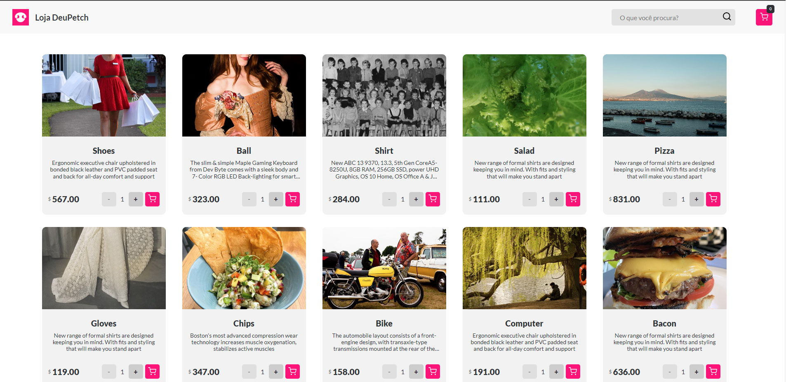

<p align="center">
  
</p>

<p align="center">
  
  
  
</p>
<p align="center">
  
</p>
<br>

# Documentação

## Descrição do projeto

O projeto consiste em um baralho aleatório do filme Bob's Burguer. Na primeira tela você tem que por seu nome para ter acesso as cartas, na segunda tela você recebe 5 cartas aletórias e pode puxar mais 3 cartas e embaralhar as mesmas. As cartas possuem uma foto, uma descrição e pontuação aleatória.

## Tecnologias

Esse projeto foi desenvolvido com as seguintes tecnologias:

- [Node.js](https://nodejs.org/en/)
- [React](https://reactjs.org)

### Pré-Processadores

- [SASS](https://sass-lang.com/)

## Deploy do projeto

##### Link de acesso: https://bobsburguer.website/

## Como executar

#### Como rodar o projeto

```bash
# Instalar as dependências
$ npm install
# Iniciar o projeto
$ npm start
```

O app estará disponível no seu browser pelo endereço http://localhost:3000.

## Layout

<p align="center">
    
</p>
